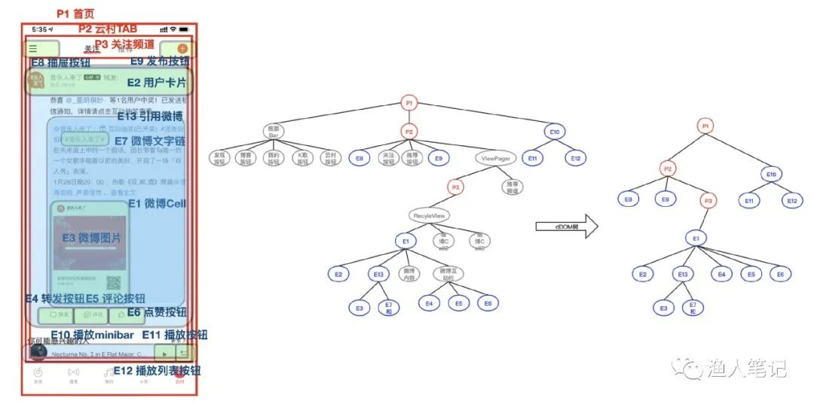
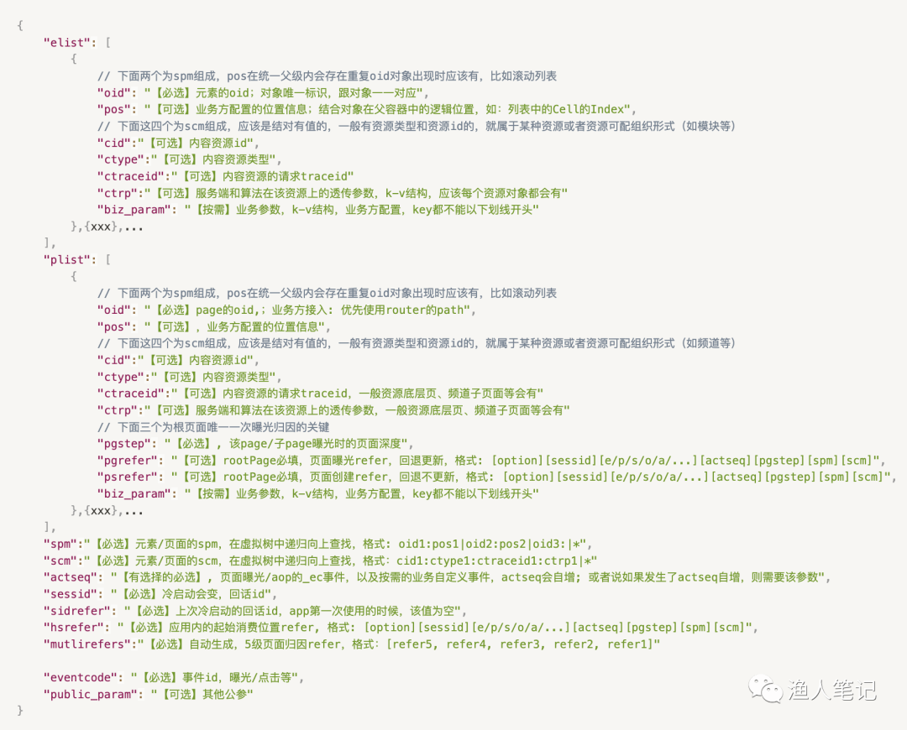
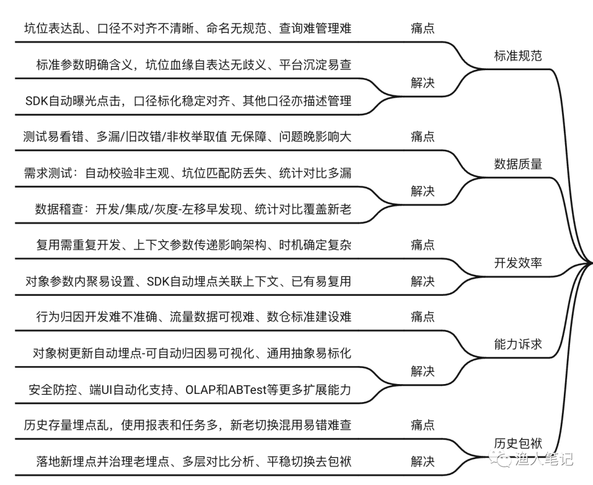
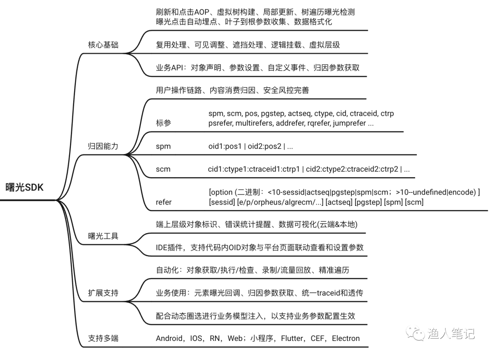
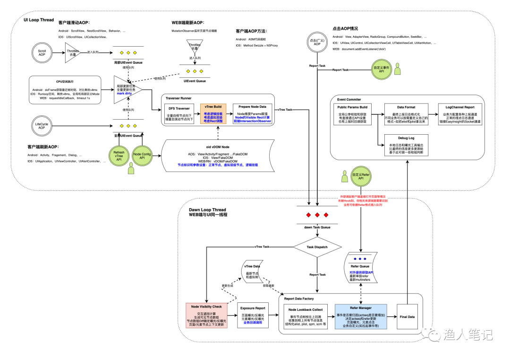
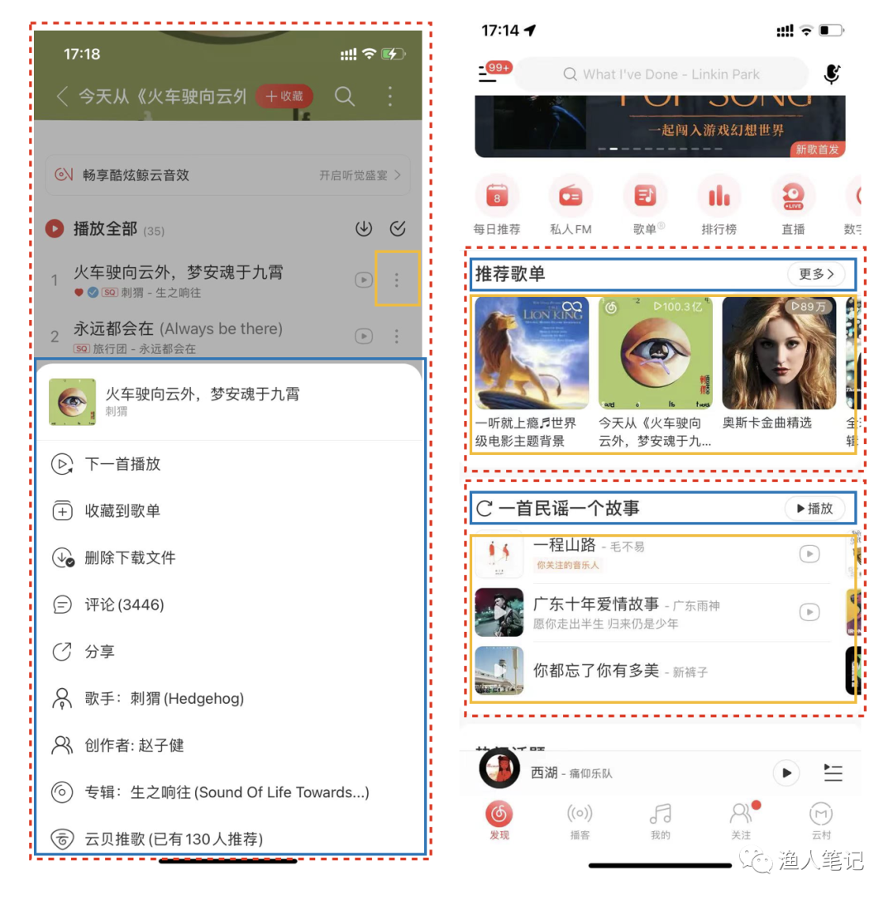

# 关于曙光埋点

:::tip Tip

> 曙光埋点集**自动化埋点**与**全链路追踪**等特点于一身，近乎完美地解决了传统埋点的所有痛点，兼顾了开发效率与埋点数据的高精度特点。
>
> **[官方Demo试用](./category/官方Demo)** <br/>
> **[快速接入曙光埋点](./category/快速开始)**

:::

## 背景

&emsp;&emsp;在当前移动互联网时代，一个产品想快速、准确的抢占市场，无疑是需要产品快速迭代更新，如何协助产品经理对产品当前的数据做出最优判断是关键，这就需要客户端侧提供**高精度**、**稳定**、**全链路**的埋点数据；做客户端开发的同学都深刻知道，想要在开发过程中满足上述三点，开发过程都是头大的；

&emsp;&emsp;针对这个问题，我们自研了一套全链路埋点方案，从埋点设计、到客户端三端(***iOS***、***Android***、***H5***)开发、以及埋点校验&稽查、再到埋点数据使用，目前已经广泛应用于云音乐各个主要APP。

## 埋点价值

&emsp;用户行为数据分析驱动的算法个性化推荐和人工精细化运营已成为各个产品必不可缺的配置，数据成为各产品的核心竞争力之一，各厂均开始致力于建设自己的数据仓库和数据中台。从下图可见是整个数据链路的起源，决定了整个数据体系的质量和能力。


## 业内方案

- **[x-path](https://mp.weixin.qq.com/s?__biz=Mzg5MTAzNDY2Mw==&mid=2247483820&idx=1&sn=2e5d2a5e24dd643177f808c41fbd89b7&scene=21#wechat_redirect)描述法**: Mixpanel、[GrowingIO](https://mp.weixin.qq.com/s?__biz=MzI2MTAxOTk5OQ==&mid=2650946510&idx=1&sn=e4481bceb86c8dcab51d1272eb6478e5&scene=21#wechat_redirect)、[神策](https://mp.weixin.qq.com/s?__biz=MzA4OTY1MTE5NA==&mid=2247483983&idx=1&sn=1c4920d8c3bd6f0ca1cf57f5e6df17e1&scene=21#wechat_redirect)、以及网易的HubbleData等
- **腾讯、美团、字节、快手**：结合坑位示意图、参数管理进行面向坑位的埋点精确管理，定位描述由平台随机生成或策划按默认规范输入，埋点参数均由开发面向坑位手动设置无层级上下文汇总收集，并结合IDE插件打通开发和测试赋能进行提效面向坑位的埋点精确管理。（参考：[字节跳动大规模埋点数据治理最佳实践](https://mp.weixin.qq.com/s?__biz=MzkwNTIwNzc3OQ==&mid=2247484944&idx=1&sn=b76a984e04e6c48ddf648f4875ac4f9e&scene=21#wechat_redirect)）
- **美团**: 实现埋点的完全策划/BI自助化，打通实现坑位圈选定位(x-path)和模型对应的参数配置，建设[MTFlexbox上的可视化自动埋点](https://mp.weixin.qq.com/s?__biz=MjM5NjQ5MTI5OA==&mid=2651750545&idx=2&sn=782cbb64eeb08bfbe406832e64217782&scene=21#wechat_redirect)，实现了埋点的完全策划/BI自助化
- **阿里/网易严选/早期云音乐**：通过四段式SPM(站点.页面.页面区块.区块内点位)和SCM(投放系统ID.投放算法ID.投放算法版本ID.投放人群ID) 进行位置和内容的标准化描述，开发亦是面向坑位进行坑位进行标识和参数设置，无层级上下文汇总收集，在埋点上各端均做了AOP实现自动化，并通过截图图像编码打通平台进行更多业务参数的可视化配置。


## 上面方案的弊端

### 坑位类的埋点方案
1. 坑位的事件埋点很简单：点击/双击/滑动等明确的事件类埋点，很简单，根据需求一个一个埋上去即可
2. 资源位曝光埋点是噩梦：在列表/非列表资源的曝光埋点场景，想做到**高精度**(埋点精度提到 ***99.99%***)难度很大，你有可能每一个曝光埋点都需要考虑如下大部分场景：

4. 每个坑位都是独立的：坑位之间的埋点没有关系，需要给每一个坑位**起名字**（比如通过随机字符串，或者组合参数来标识），页面、列表、元素之间，存在大量的重复参数，以达到数据分析要求
5. 漏斗/归因分析难：由于每一个坑位埋点都是独立的，APP使用过程中先后产生的埋点是无关联的，想要做到漏斗/归因分析，需要客户端做***魔鬼参数***传递，然后数据分析时再逐个场景的做参数关联分析
6. 坑位黑盒：想知道一个app有多少坑位埋点，当前页面下已经显现出了多少坑位，坑位之间是什么关系，管理成本高

### x-path类的方案

- **有时也叫`无痕埋点`**: 我们曾经也做过类似的尝试；主要是针对一些坑位事件（比如点击、双击、滑动等事件）埋点做自动生成埋点，同时附带上生成的**xpath**（根据view层级生成），然后把埋点上报到数据平台后，再将xpath赋予真实的业务意义，从而可以进行数据分析；
- **不稳定，复杂UI场景难以提高精度**: 但是这个方案的问题是只能处理一些简单事件场景，并且数据平台做xpath关联是一件噩梦，工作量大，最主要的是**不稳定**，对于埋点数据高精度场景，这个方案不可行（没有哪个客户端开发人员天天花费大量时间查找 xpath 是什么意义，以及随着迭代业务的开发，xpath由于不受控制的变化带来的数据问题带来的排查工作量是巨大的）。
- **资源关联困难**: 特别对于资源位的曝光上，想要做到真正的无痕，自动埋点，是有些难度的（全靠数据层面后置识别，精度难以保障）。

## 曙光埋点的优势

### 虚拟对象树

&emsp;在曙光埋点中，考虑到x-path的位置描述其实存在较多无数据意义的层级且这些层级又往往随着端上同学的样式重构修改而变化(往往会有容器层级的新增或类型修改)，而在实际埋点中往往仅需要关注的是包含若干层级的资源卡片、模块频道容器、互动组件等，如果可以仅将这些层级标注出来并进行自汇总，那么定位的描述如果产品设计层面未发生需求变动的情况下，就是稳定易懂且可多端一致的(毕竟不同端上产品设计是一致的)。基于此，引入了如下所示的埋点对象概念，在整个DOM树中，通过oid去标识所需要的对象层级(图示意用，实际层级比画出的更多，仅红色-页面和蓝色-元素的层级进行oid标记)，借助DOM树的结构，自然形成了一个稀疏的埋点对象树。



### 自动打点与链路追踪

&emsp;整个曙光埋点的基本思想就是要在端上(客户端&跨端&前端)构建页面的埋点对象树并保持同步更新，实现页面和元素曝光的自动埋点，以及通过用户行为API的Hook实现点击的自动埋点。


&emsp;如上图示意，曙光建设了业务无感的自动埋点SDK，自动生成和更新页面的对象树，实现曝光和点击事件的自动化埋点，在坑位埋点生成时从对应节点往上查找到根对象节点，收集树支上所有节点业务设置的参数，即可自动生成坑位的标准化位置SPM和内容SCM描述；在此基础上SDK内有序记录了相关埋点事件，识别出途中用户操作行为，直接在埋点生成时按约定格式生成和记录refer参数，以进行高效准确的行为归因。同时亦可以看出，该方案对于组件化的内容型架构特别友好，对于卡片在不同场景再复用再组织的情况，卡片本身是无需再重复埋点的。

### 多端一致性

&emsp;标准规范一致，包括 `参数格式一致`、`oid和spm定义一致`、曝光点击等 `事件口径一致`，解决了业界基于x-path和Accessibility的各种UI自动化方案未曾根本解决的对象准确快速查找和用例稳定性差及运行效率低问题，方案中涉及的相关参数标准和埋点结构约定如下，列出了主要关键参数及含义。



### 完善的流程服务

&emsp;在此基础上，建设相应埋点平台来进行埋点需求管理、参数等元数据管理、以及埋点测试和稽查校验等，整体形成了如下流程：


&emsp;回到上文的痛点分析，配合SDK和平台，以及基于曙光埋点的后续UI自动化等的能力建设，我们针对于各个痛点的解决思路可以总结如下：



## 曙光埋点 SDK

&emsp;曙光SDK是整个方案实现的核心，其整体包含内容如下，当前已完成Android，IOS，WEB，RN四端的支持：



&emsp;为了更好标准化，我们将标准的事件限定成曝光和点击两个大事件，再通过对象的spm和scm去区分详细的事件业务含义。比如，老的埋点方案中(一般业界也多采用这类定义)，端上的关注事件会定义EventCode为"focus"，在曙光中会直接定义成可以发生关注行为的元素点击操作(一般会采用相同oid==btn_focus来统一定义)，故整体上点击事件的表现力是比较充分的。而曝光上，我们区分了页面和元素，页面的曝光和反曝光会触发对应节点往下的元素曝光检测，且页面节点依据其所处层级不同有根页面和子页面区分，但业务开发无需关心，只需API设置elementOID和pageOID。基于此，SDK的基本核心功能就是在各端通过SDK去实现页面/元素曝光和点击事件的自动埋点，并自动记录和关联用户行为。目前在Android、IOS、WEB三端的SDK处理流程如下图所示。

&emsp;图中关键流程：通过系统AOP触发树更新，在主线程依据页面实际DOM树的遍历过滤出OID节点生成虚拟树，将树更新事件推送给曙光工作线程去进行视图的可见遮挡交叉判断以进行曝光埋点的自动生成，进而在工作线程依据树结构进行埋点节点的树枝回溯收集相关节点的参数进行架构化；同时在工作线程中维护了用户行为链路的refer参数（由页面曝光、元素点击、用户自定义和插入refer组成），这些refer参数会在埋点中被直接带上，供数据侧消费归因。
&emsp;图中绿色圆圈为开放给业务开发使用的API，其包含了节点的参数设置、主动触发刷新（部分极特殊情况页面更新未被AOP的业务可自行触发）、自定义埋点事件、未AOP的Refer插入等四部分，整体操作很轻量，最主要的节点参数设置API与各端给View设置显示数据的实际可保持一致，且各层只需关注自己的参数，所处的父级模块、页面等信息由SDK在埋点回溯时自动收集。

&emsp;当然这是理想状态下的主流程，在整体方案中在前端和客户端均会存在特殊情况需要去抹平，如图中粉色背景的方块中，在生成vTree的过程中，为了尽可能达到多端一致，以及满足业务数据需求的情况，我们支持了逻辑挂载来将一个节点脱离本身View父子关系建立新的父子关系（如上图左，点击歌曲更多打开的浮层可能是一个独立Window，与歌单页和内部的元素无父子关系；但是在数据分析上，会希望看到浮层内的各个点击可以看到歌单页以及对应歌曲卡片的信息，这时候可以选择将浮层对象逻辑挂载到歌单卡片或者歌单页对象下），以及虚拟层级以支持对原本不存在的View父子层级增加一个可分析的数据层级（如上图右，对于模块内的各个歌单和歌曲卡片以及头部的更多、播放按钮的埋点事件，会需要知道所属的模块信息，但端上可能并不存在整个模块的层级--图中红色虚线，只是头部和下方横向滚动列表在整体列表上的拼接假象，对于端开发同学为了减少UI层级这种情况是比较常见的，此时可以通过增加一层与虚线红框对应的虚拟模块节点来快速达到目的）。

&emsp;SDK内对于View的曝光可见性也做了较为完备的扩展支持和判断，业务可以通过API去修改View的实际Frame(显示Rect，以便支持半透实际背后可见等情况)。同时，在曝光检测中，也以节点的可见区域和树结构，做了严格的遮挡对比判断，整体原则和流程如上图所示。
&emsp;如上为Android、IOS、WEB三端的整体情况，其中WEB端的方案基于DOM而非VDOM操作，可以适配各种不同前端技术栈。对于RN类Native渲染的跨端平台，其在JS端保持与WEB端相同的Component配置API，然后客户端通过ViewManager扩展属性，将相关节点配置对应到Native侧的实际View节点即可，其他流程与原生是一致。

``` c
/* Android端BaseViewManager中扩展：*/
@ReactProp(name = "eventTracing")
public void setEventTracing(@Nonnull T view, @Nullable ReadableMap eventTracing) {
  // 调用客户端侧曙光埋点SDK的节点设置API
}

/* iOS端RCTViewManager中扩展：*/
RCT_CUSTOM_VIEW_PROPERTY(eventTracing, NSDictionary *, RCTView) {
  // 调用客户端侧曙光埋点SDK的节点设置API
}
```

&emsp;除了SDK的核心功能之外，曙光项目还开发了一个工具，以支持各端直接进行对象和层级查看，辅助开发测试。


## 管理平台 EasyInsight

&emsp;EasyInsight是曙光建设的埋点管理平台，在数据埋点的事前中后均起着非常重要的作用，平台的整体包含的功能简介如下图所示


<br/>
<br/>
<br/>
<br/>
<br/>
